# 🌿 Plant Disease Detection Using Deep Learning

> **Senior Design Project** · VIT-AP University · Dec 2024  
> **Team:** Satyala Murali Karthik · **Mekala Samuel** · Kurmala Bhanu Prakash  
> **Guide:** Dr. S. Kalyani · School of Computer Science & Engineering

[](https://python.org)
[](https://tensorflow.org)
[](https://pytorch.org)
[](/.github/workflows/ci.yml)

---

## 📌 Overview

Plant diseases are a major threat to global food security. This project builds an **automated deep learning system** that classifies plant leaf images into **38 healthy and diseased categories** using the <a href="https://www.kaggle.com/datasets/vipoooool/new-plant-diseases-dataset" target="_blank">New Plant Diseases Dataset</a> (87,000+ images from Kaggle).

We implemented and **benchmarked 7 CNN architectures** side-by-side using transfer learning, and integrated the best model into a **real-time GUI** for practical agricultural use.

---

## 🏗️ System Architecture

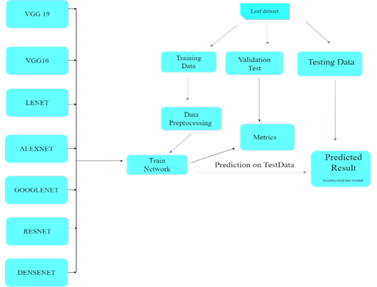

```
Input: Leaf Image (any resolution)
            │
            ▼
┌─────────────────────────┐
│   Image Preprocessing   │
│  • Resize → 224×224     │
│  • Normalize (ImageNet) │
│  • Augment (flip/crop/  │
│    rotate/color jitter) │
│  • 70/15/15 split       │
└──────────┬──────────────┘
           │
┌──────────┴──────────────────┐
│   CNN Model Selection       │
│                             │
│  LeNet-5 → AlexNet →        │
│  VGG16 → VGG19 →            │
│  ResNet-50 → DenseNet →     │
│  GoogleNet (Best)           │
└──────────┬──────────────────┘
           │
           ▼
┌───────────────────────┐
│  Softmax Output       │
│  38 disease classes   │
└───────────────────────┘
           │
           ▼
  Predicted Disease Class
  + Confidence Score
```
 
---
## 🏆 Model Benchmark
 
| Model | Accuracy | Parameters | Speed | Architecture Highlights | Use Case |
|---|---|---|---|---|---|
| **GoogleNet** ✅ | **99.10%** | 6.8M | Fast | Inception modules · 22 layers | ✅ Best trade-off: accuracy + speed |
| DenseNet | ~98.5% | 7.9M | Medium | Dense connectivity · feature reuse | Near-best with compact params |

| ResNet-50 | ~97.8% | 25.6M | Medium | 50 layers · Skip connections | Avoids vanishing gradients |
| VGG-19 | ~97.2% | 143.7M | Slow | 16 conv + 3 dense · deeper VGG | High spatial detail |
| VGG-16 | ~96.5% | 138.4M | Slow | 13 conv + 3 dense · 224×224 | Feature-rich classification |
| AlexNet | ~94.1% | 60.9M | Fast | 5 conv + 3 FC · ReLU · Dropout | Fast inference |
| LeNet-5 | ~85.0% | 0.06M | Fastest | 2 conv + 2 FC layers · 32×32 input | Lightweight baseline |
 
---

## 📊 Results
  
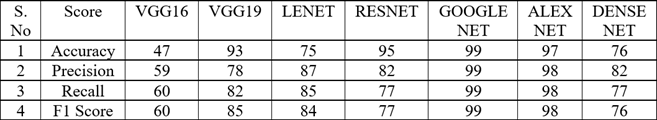
 
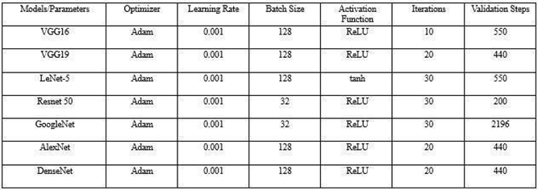

### GoogleNet — Best Model (99.1% Accuracy)

| Accuracy | Loss |
|---|---|
| 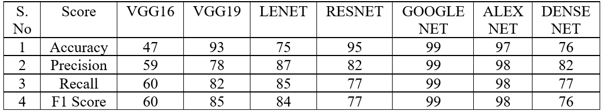 | | 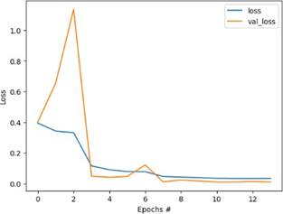 |

### AlexNet
 
| Accuracy | Loss |
|---|---|
|  | |  |
 
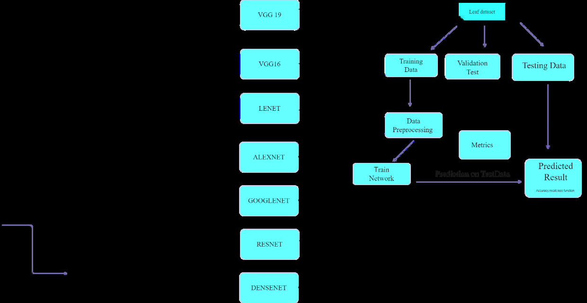
 
### Other Models
 
| VGG16 Accuracy | VGG16 Loss |
|---|---|
| 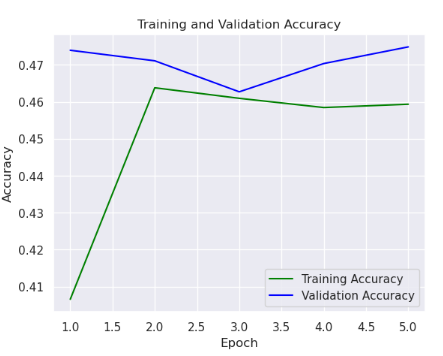 | 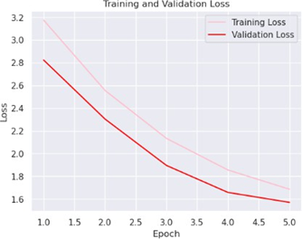 |
 
| VGG19 Accuracy | VGG19 Loss |
|---|---|
| 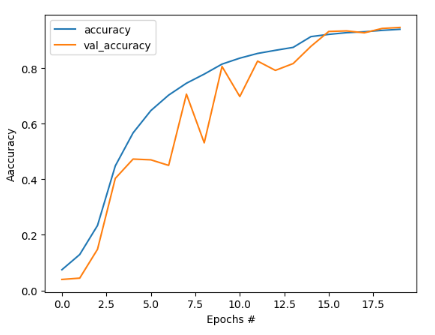 | 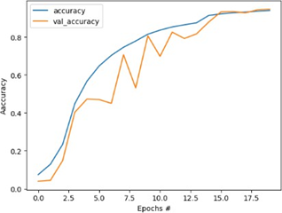 |
 
| ResNet Accuracy | ResNet Loss |
|---|---|
| 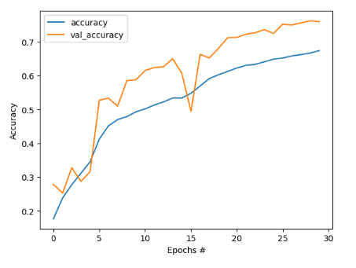 | 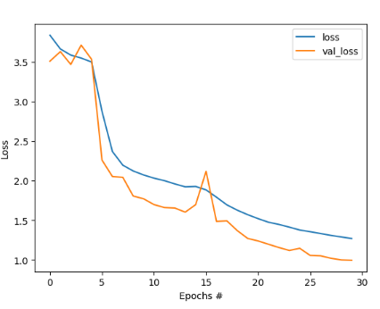 |
 
| DenseNet Accuracy | DenseNet Loss |
|---|---|
| 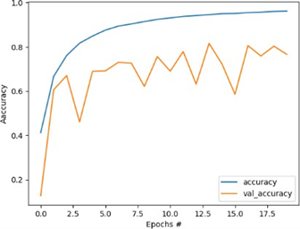 | 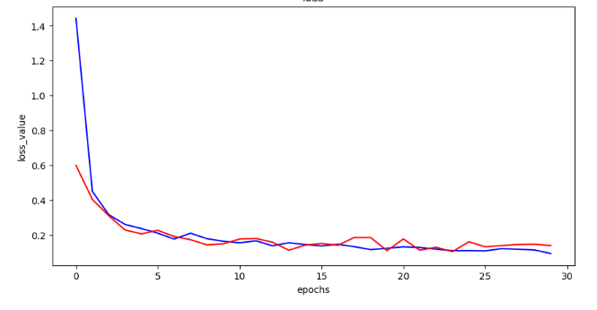 |
 
| LeNet-5 Accuracy | LeNet-5 Loss |
|---|---|
| 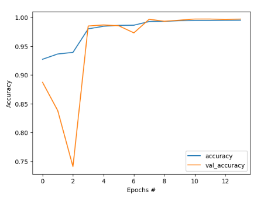 | 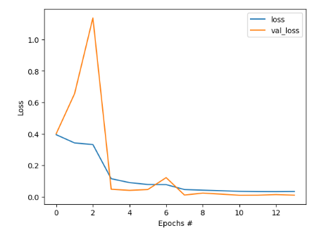 |
 
---

## 🖥️ GUI — Real-Time Prediction

A **Tkinter-based desktop GUI** was built for real-time leaf disease classification:
- Upload any leaf image via file dialog
- Instant disease class prediction with confidence score
- User-friendly interface for farmers and agricultural experts
 
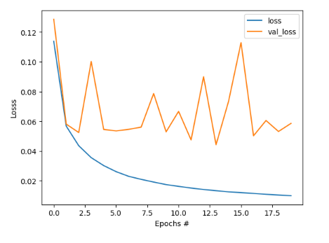
 
---

## 🔑 Key Engineering Decisions
 
**Why Inception modules (GoogleNet)?**
Multiple parallel conv filters (1×1, 3×3, 5×5) capture fine-grained texture and broader shape simultaneously — critical for distinguishing visually similar diseases.
 
**Why transfer learning on ImageNet weights?**
Plant disease features share low-level representations with ImageNet objects. Transfer learning converges 3–4x faster and reaches higher accuracy than training from scratch.
 
**Why data augmentation?**
Real farm conditions vary — different lighting, angles, distances. Augmentation forces the model to generalize beyond lab conditions.
 
**Why early stopping (patience=3)?**
Prevents overfitting without manual epoch tuning. Validation loss is the monitor — not accuracy, to avoid misleading plateau detection.
 
---

## ⚙️ Methodology

### Dataset
- **87,000+ images** across **38 classes** (plant species × disease/healthy states)
- Format: JPEG · Varied resolutions

### Preprocessing Pipeline
```
Raw Images
    → Resize (224×224 for most; 32×32 for LeNet-5)
    → Normalize (ImageNet mean=[0.485,0.456,0.406], std=[0.229,0.224,0.225])
    → Augment (H/V Flip · Rotation ±20° · Random Crop · Color Jitter)
    → Tensor Conversion
    → Split (70% Train / 15% Val / 15% Test)
```

### Training Configuration
- **Loss Function:** CrossEntropyLoss
- **Optimizer:** Adam (lr=0.001) / SGD with momentum
- **Scheduler:** StepLR (step_size=7, γ=0.1)
- **Regularization:** Dropout + Early Stopping (patience=3)
- **Max Epochs:** 20

---

## 🛠️ Tech Stack


**Hardware:** GPU-enabled (NVIDIA CUDA) · 8GB+ RAM

**Dataset:** New Plant Diseases Dataset · Kaggle · 87,000+ images · 38 classes

---

## 📁 Project Structure
 
```
plant-disease-detection/
├── .github/
│   └── workflows/
│       └── ci.yml                  # GitHub Actions CI
├── images/
|   ├── comparision.png
|   ├── parameters.png
│   ├── googlenet_accuracy.png
│   ├── googlenet_loss.png
│   ├── alexnet_accuracy.png
│   ├── alexnet_loss.png
│   ├── vgg16_accuracy.png
│   ├── vgg16_loss.png
│   ├── vgg19_accuracy.png
│   ├── vgg19_loss.png
│   ├── resnet_accuracy.png
│   ├── resnet_loss.png
│   ├── densenet_accuracy.png
│   ├── densenet_loss.png
│   ├── lenet_accuracy.png
│   ├── lenet_loss.png
│   ├── lenet_architecture.png
│   ├── model_comparison_table.png
│   ├── sample_predictions.png
│   └── gui_screenshot.png
├── alexnet.py                      # AlexNet — training + evaluation + confusion matrix
├── googlenet.py                    # GoogleNet — best model (99.1%)
├── models.py                       # LeNet-5, VGG16, VGG19, ResNet50, DenseNet
├── requirements.txt
└── README.md
```

---

## 🚀 How to Run
 
```bash
# Clone the repo
git clone https://github.com/samuel-mekala/plant-disease-detection.git
cd plant-disease-detection
 
# Install dependencies
pip install -r requirements.txt
 
# Download dataset from Kaggle:
# https://www.kaggle.com/datasets/vipoooool/new-plant-diseases-dataset
 
# Train best model (GoogleNet)
python googlenet.py
 
# Train AlexNet
python alexnet.py
 
# Train other models
python models.py --model vgg19
python models.py --model resnet50
python models.py --model densenet
python models.py --model lenet5
python models.py --model vgg16
```

---

## 🔮 Future Work

- [ ] Ensemble learning combining GoogleNet + DenseNet
- [ ] Vision Transformers (VIT) for spatial attention
- [ ] Mobile deployment via TensorFlow Lite / ONNX
- [ ] Explainable AI with Grad-CAM visualizations
- [ ] Multilingual voice-based interface for rural farmers

---

## 📚 References

1. Mohanty et al. (2016) — AlexNet & GoogLeNet on PlantVillage dataset
2. Ferentinos (2018) — VGG & ResNet transfer learning for plant disease
3. He et al. (2015) — Deep Residual Learning (ResNet)
4. LeCun et al. (2015) — Deep Learning foundations

---

*VIT-AP University · Computer Science & Engineering · Dec 2024*
